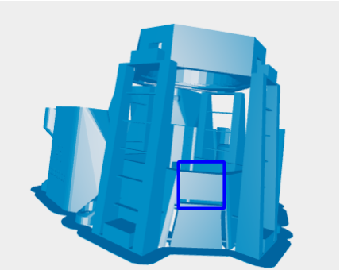
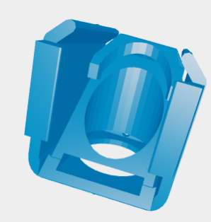

# Building Your OpenFlexure Microscope (v7.0.0-beta2) - Modified Instructions

This guide provides modified instructions for building the OpenFlexure Microscope v7.0.0-beta2, incorporating necessary deviations from the official build guide.  Refer to the official guide for the primary instructions: [https://build.openflexure.org/openflexure-microscope/v7.0.0-beta2/high_res_microscope.html](https://build.openflexure.org/openflexure-microscope/v7.0.0-beta3/high_res_microscope.html)

## Deviations

The following sections detail the necessary changes to the official build process.

### 1. Main Body Assembly

During the main body assembly, you'll need to modify the 3D printed part.  The official instructions don't account for a necessary change.  Specifically, **remove the brace highlighted in the blue square in the image below**.   

 
This brace interferes with later steps.  While ideally, this model would be edited in FreeCAD, this may not be readily achievable for all users. Therefore, physical removal is the recommended workaround.

### 2. Optics Module Assembly

The optics module assembly also requires modifications.  Refer to the official optics module instructions: [https://build.openflexure.org/openflexure-microscope/v7.0.0-beta2/high_res_optics_module.html](https://build.openflexure.org/openflexure-microscope/v7.0.0-beta2/high_res_optics_module.html)

**Changes:**

*   Beam Splitter Housing: Instead of the standard part, use the file `Openflexure_Additions/optics_picamera2_rms_f50d13_beamsplitter_delta.stl`. This modified housing is designed to accommodate the specific beam splitter you'll be using.

*   Beam Splitter Cube: Use the file `Openflexure_Additions/fl_cube.stl` for the beam splitter cube.  The final assembled cube should resemble the image below. 
 

 
 
* For detailed instructions please follow the instructions on this page steps 6-11. https://build.openflexure.org/openflexure-delta-stage/v1.2.0/pages/reflection_illumination.html

* Instead of step 12, use the laser tube found here: Openflexure_Additions/laser_holder.stl.  It should attach simularly  to the the excitation filter does in step 12.

*   Beam Splitter Installation:  Carefully insert your purchased beam splitter (see the spreadsheet for description and link) *inside* the 45-degree clip of the `fl_cube.stl` part.  **Important: You may need to carefully cut the glass of the beam splitter to ensure it fits correctly within the clip.**

*   Optics Tube and Laser Holder: After installing the beam splitter in the cube, insert the assembly into the optics tube.  Attach the laser holder using the file `Openflexure_Additions/laser_holder.stl`. The shaft of the laser holder should fit snugly into the slot you created by removing the brace from the main body (step 1).

### 3. Remaining Assembly

Once you have completed the above modifications, continue following the remaining instructions in the official OpenFlexure build guide.

## Important Notes

*   Refer to the official OpenFlexure documentation for any steps not explicitly covered in these modified instructions.

